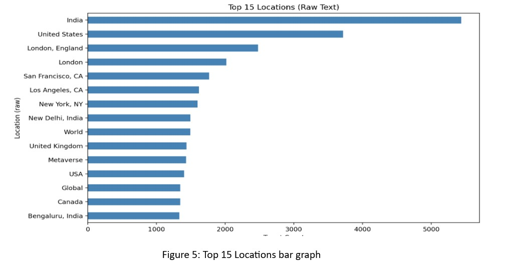
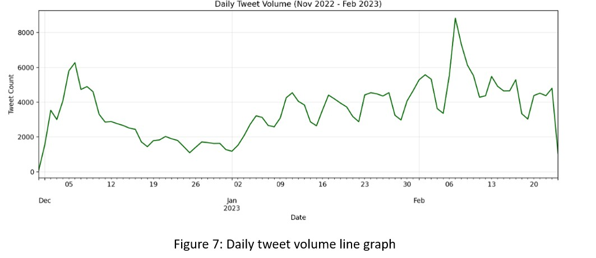
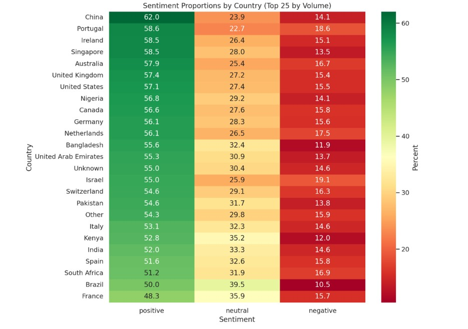
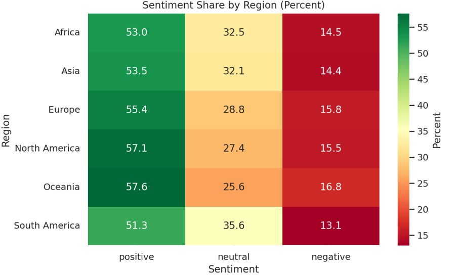

# 🌍 Worldwide Sentiment Analysis of Large Language Models (LLMs)

> End-to-end NLP, geospatial analysis, and time-series forecasting on 305K+ tweets  

---

## 🔎 Problem Statement
How is public sentiment toward Large Language Models evolving **across regions and time**, and where are early warning signals of declining trust emerging?

---

## 🎯 Objectives
- Monitor sentiment toward LLMs globally
- Identify regions with worsening sentiment
- Detect entities & topics driving concern
- Support data-driven AI policy decisions

---

## 🗂 Dataset
- **305,432 tweets** from X (Twitter)
- Time range: Nov 2022 – Feb 2023
- Languages: 36 (99.2% English)
- Major regions: India, USA, Europe

📁 Data schema → `data/README.md`

---

## 📊 Exploratory Data Analysis
Key insights:
- Sharp spike after ChatGPT launch (Dec 2022)
- Sustained engagement (3K–6K tweets/day)
- India & USA dominate tweet volume

---

## 🧹 Data Cleaning & Location Normalization
**Challenge:**  
72.8% tweets labeled `Other/Unknown` due to noisy user locations.

**Solution:**  
- Alias mapping  
- Bio-based inference  
- Probabilistic city-to-country resolution  
- Controlled geocoding  

✅ Reduced `Other + Unknown` → **43.85%**

---

## 😊 Sentiment Analysis
- Tool: **VADER (NLTK)**
- Outputs: sentiment label + compound score

---

## 📈 Modeling
### Regression
- Ridge regression on log-likes
- R² (log): 0.147

### Time Series
- SARIMAX with weekly seasonality
- Accurate short-term forecasting

---

## 🌎 Key Findings
- Sentiment declining fastest in **South America**
- Bard/Gemini receives consistently lower sentiment
- Cybersecurity & education are major concern areas

---

## 🏛 Policy Implications
- Regional monitoring is essential
- Transparency gaps exist for major AI vendors
- Sentiment can act as early warning for regulatory risk

---

## 🛠 Tech Stack
Python • Pandas • NLTK • Statsmodels • Plotly • SARIMAX

---
